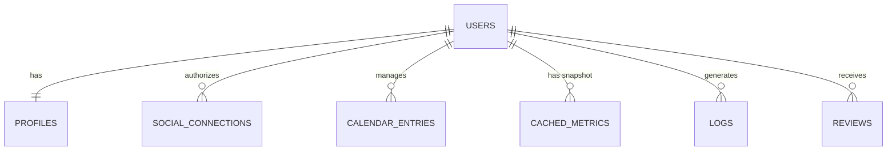

# Database Design: API-First Architecture

## Overview
This schema is designed to support the **Connected Influencer** workflow.
1.  **Social Media:** Data (Metrics & Media) is fetched directly from APIs (Instagram, YouTube, Facebook) using stored access tokens.
2.  **Calendar:** Strictly manages "Shoots" and "Uploads" created via the "Add Calendar" form.

---

## Schema Design

### 1. Users (Authentication)
Standard login and account management.

**Table: `users`**
| Column | Type | Constraints | Description |
| :--- | :--- | :--- | :--- |
| `id` | UUID | PK | Unique User ID |
| `email` | VARCHAR(255) | UNIQUE, NOT NULL | Login email |
| `password_hash` | VARCHAR | NOT NULL | Secure password storage |
| `created_at` | TIMESTAMP | DEFAULT NOW() | |

### 2. Profiles (Sharable Link Base)
Stores the static public info for the portfolio link.

**Table: `profiles`**
| Column | Type | Constraints | Description |
| :--- | :--- | :--- | :--- |
| `user_id` | UUID | PK, FK(users.id) | Link to User |
| `slug` | VARCHAR(50) | UNIQUE, NOT NULL | **Sharable Link** (e.g., /p/sarah) |
| `display_name` | VARCHAR(100) | NOT NULL | Public Name |
| `bio` | TEXT | | Short bio |
| `avatar_url` | VARCHAR | | Profile picture |
| `categories` | TEXT[] | | Tags (e.g., ['Fashion']) |
| `budget_min` | INTEGER | | Minimum budget preference |
| `budget_max` | INTEGER | | Maximum budget preference |

### 3. Social Connections (OAuth Tokens)
**CRITICAL:** Stores the keys to access the external APIs (FB, IG, YT). We use these to fetch Metrics and Media on the fly (or cache them).

**Table: `social_connections`**
| Column | Type | Constraints | Description |
| :--- | :--- | :--- | :--- |
| `id` | UUID | PK | Unique Connection ID |
| `user_id` | UUID | FK(users.id) | Owner |
| `platform` | ENUM | NOT NULL | 'instagram', 'facebook', 'youtube' |
| `platform_user_id` | VARCHAR | NOT NULL | ID from the platform (e.g., IG User ID) |
| `access_token` | TEXT | NOT NULL | **The Key** to fetch data |
| `refresh_token` | TEXT | | To get new access tokens |
| `token_expires_at` | TIMESTAMP | | When we need to refresh |
| `is_connected` | BOOLEAN | DEFAULT TRUE | Connection status |

### 4. Calendar Entries (Shoots & Uploads)
Stores the manual entries from the "Add Calendar" form.

**Table: `calendar_entries`**
| Column | Type | Constraints | Description |
| :--- | :--- | :--- | :--- |
| `id` | UUID | PK | Unique Entry ID |
| `user_id` | UUID | FK(users.id) | Owner |
| `type` | ENUM | NOT NULL | **'shoot'** or **'upload'** |
| `brand_name` | VARCHAR(100) | NOT NULL | Name of the brand |
| `campaign_name` | VARCHAR(200) | | Campaign details |
| `date` | DATE | NOT NULL | Event date |
| `time` | TIME | | Event time |
| `status` | ENUM | DEFAULT 'pending' | 'pending', 'completed' |
| `notes` | TEXT | | Additional details |
| **Shoot Specific** | | | |
| `location` | VARCHAR | | Only for Shoots |
| **Upload Specific** | | | |
| `platform` | ENUM | | 'instagram', 'youtube', etc. (Only for Uploads) |
| `content_type` | VARCHAR | | 'Reel', 'Post', 'Story' (Only for Uploads) |

### 5. Cached Metrics (Optional but Recommended)
To avoid hitting the API every single time the portfolio loads, we store the latest snapshot of the metrics.

**Table: `cached_metrics`**
| Column | Type | Constraints | Description |
| :--- | :--- | :--- | :--- |
| `id` | UUID | PK | Unique ID |
| `user_id` | UUID | FK(users.id) | Owner |
| `platform` | ENUM | NOT NULL | Platform |
| `follower_count` | INTEGER | | Last fetched count |
| `engagement_rate` | DECIMAL | | Last calculated rate |
| `last_updated` | TIMESTAMP | DEFAULT NOW() | When we last hit the API |

### 6. Logs (System & User Activity Tracking)
Stores comprehensive logs for debugging, auditing, and monitoring system activities.

**Table: `logs`**
| Column | Type | Constraints | Description |
| :--- | :--- | :--- | :--- |
| `id` | UUID | PK | Unique log entry |
| `user_id` | UUID | FK(users.id), NULLABLE | User related to the log (if any) |
| `platform` | ENUM | NULLABLE | 'instagram', 'facebook', 'youtube' |
| `action` | VARCHAR(100) | NOT NULL | What happened (fetch_metrics, refresh_token, login, update_calendar…) |
| `status` | ENUM | NOT NULL | 'success', 'failure' |
| `message` | TEXT | | API response or error message |
| `request_payload` | JSONB | | What you sent to API (optional) |
| `response_payload` | JSONB | | API response (optional) |
| `ip_address` | VARCHAR(50) | | User IP for security logs |
| `created_at` | TIMESTAMP | DEFAULT NOW() | When it happened |

### 7. Reviews (Client Feedback)
Stores client reviews and ratings for influencers.

**Table: `reviews`**
| Column | Type | Constraints | Description |
| :--- | :--- | :--- | :--- |
| `id` | UUID | PK | Unique review ID |
| `user_id` | UUID | FK(users.id) | Influencer being reviewed |
| `client_name` | VARCHAR(100) | NOT NULL | Name of the client |
| `client_email` | VARCHAR(255) | | Client email (optional) |
| `rating` | INTEGER | NOT NULL, CHECK (1-5) | Rating out of 5 stars |
| `review_text` | TEXT | NOT NULL | Review content |
| `project_type` | VARCHAR(100) | | Type of collaboration (e.g., "Product Review", "Brand Campaign") |
| `is_verified` | BOOLEAN | DEFAULT FALSE | Whether review is from verified client |
| `is_published` | BOOLEAN | DEFAULT TRUE | Whether review is visible (for moderation) |
| `created_at` | TIMESTAMP | DEFAULT NOW() | When review was submitted |

## Data Flow
1.  **Connect:** User authorizes App -> We get `access_token` -> Store in `social_connections`.
2.  **Portfolio View:** App uses `access_token` to call Instagram/YouTube API -> Fetches latest Posts & Stats -> Displays on Portfolio (and updates `cached_metrics`).
3.  **Calendar:** User fills "Add Shoot" form -> Saves to `calendar_entries`.

## ERD Concept

