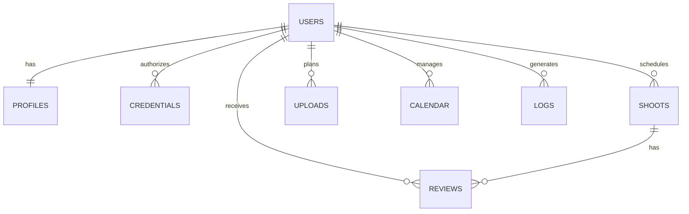

# Database Design: Influencer Platform

## Overview
This schema supports the influencer platform workflow with social media integration, shoot/upload scheduling, calendar management, client reviews, and comprehensive logging.

---

## Schema Design

### 1. Users (Authentication)
User authentication and account management.

**Table: `users`**
| Column | Type | Constraints | Description |
| :--- | :--- | :--- | :--- |
| `id` | UUID | PK | Unique User ID |
| `email` | VARCHAR(255) | UNIQUE, NOT NULL | Login email |
| `password` | VARCHAR | NOT NULL | Hashed password |
| `created_at` | TIMESTAMP | DEFAULT NOW() | Account creation timestamp |

---

### 2. Profiles (Public Portfolio)
Stores public profile information for the sharable portfolio link.

**Table: `profiles`**
| Column | Type | Constraints | Description |
| :--- | :--- | :--- | :--- |
| `id` | UUID | PK | Unique Profile ID |
| `user_id` | UUID | FK(users.id), UNIQUE | Link to User |
| `slug` | VARCHAR(50) | UNIQUE, NOT NULL | Sharable link (e.g., /portfolio/sarah) |
| `display_name` | VARCHAR(100) | NOT NULL | Public display name |
| `bio` | TEXT | | Short biography |
| `category` | TEXT[] | | Content categories (e.g., ['Fashion', 'Lifestyle']) |
| `profile_photo` | VARCHAR | | Profile picture URL/path |
| `min_budget` | INTEGER | | Minimum collaboration budget |
| `max_budget` | INTEGER | | Maximum collaboration budget |

---

### 3. Credentials (OAuth Tokens)
Stores OAuth credentials for social media platform integrations.

**Table: `credentials`**
| Column | Type | Constraints | Description |
| :--- | :--- | :--- | :--- |
| `id` | UUID | PK | Unique Credential ID |
| `user_id` | UUID | FK(users.id) | Owner |
| `platform` | ENUM | NOT NULL | 'instagram', 'facebook', 'youtube' |
| `platform_user_id` | VARCHAR | NOT NULL | Platform-specific user ID |
| `access_token` | TEXT | NOT NULL | OAuth access token |
| `refresh_token` | TEXT | | OAuth refresh token |
| `created_at` | TIMESTAMP | DEFAULT NOW() | Initial connection timestamp |
| `refreshed_at` | TIMESTAMP | | Last token refresh timestamp |
| `expires_at` | TIMESTAMP | | Token expiration timestamp |

---

### 4. Shoots
Manages shoot scheduling and details.

**Table: `shoots`**
| Column | Type | Constraints | Description |
| :--- | :--- | :--- | :--- |
| `id` | UUID | PK | Unique Shoot ID |
| `user_id` | UUID | FK(users.id) | Owner |
| `date` | DATE | NOT NULL | Shoot date |
| `time` | TIME | | Shoot time |
| `location` | VARCHAR(255) | | Shoot location |
| `brand_name` | VARCHAR(100) | NOT NULL | Brand/client name |
| `campaign_name` | VARCHAR(200) | | Campaign name |
| `notes` | TEXT | | Additional notes |
| `amount` | DECIMAL(10,2) | | Collaboration amount |
| `completed` | BOOLEAN | DEFAULT FALSE | Completion status |
| `review_token` | VARCHAR(255) | UNIQUE, NULLABLE | Unique token for client review link |
| `review_link_generated_at` | TIMESTAMP | NULLABLE | When review link was generated |
| `created_at` | TIMESTAMP | DEFAULT NOW() | Shoot creation timestamp |

**Indexes:**
- `idx_shoots_user_date` on (`user_id`, `date`)
- `idx_shoots_review_token` on (`review_token`)

---

### 5. Uploads
Manages content upload scheduling.

**Table: `uploads`**
| Column | Type | Constraints | Description |
| :--- | :--- | :--- | :--- |
| `id` | UUID | PK | Unique Upload ID |
| `user_id` | UUID | FK(users.id) | Owner |
| `date` | DATE | NOT NULL | Upload date |
| `time` | TIME | | Upload time |
| `platform` | ENUM | NOT NULL | 'instagram', 'facebook', 'youtube', 'tiktok' |
| `content_type` | VARCHAR(50) | | Content type (e.g., 'Reel', 'Post', 'Video') |
| `brand_name` | VARCHAR(100) | | Associated brand name |
| `campaign_name` | VARCHAR(200) | | Associated campaign name |
| `notes` | TEXT | | Additional notes |
| `completed` | BOOLEAN | DEFAULT FALSE | Upload completion status |
| `created_at` | TIMESTAMP | DEFAULT NOW() | Upload entry creation timestamp |

**Indexes:**
- `idx_uploads_user_date` on (`user_id`, `date`)

---

### 6. Calendar
Manages user availability and date blocking.

**Table: `calendar`**
| Column | Type | Constraints | Description |
| :--- | :--- | :--- | :--- |
| `id` | UUID | PK | Unique Calendar Entry ID |
| `user_id` | UUID | FK(users.id) | Owner |
| `date` | DATE | NOT NULL | Calendar date |
| `availability_status` | BOOLEAN | DEFAULT TRUE | TRUE = available, FALSE = unavailable |

**Indexes:**
- `idx_calendar_user_date` on (`user_id`, `date`)

**Note:** Shoots and Uploads have their own date fields. This table is specifically for marking dates as unavailable/blocked.

---

### 7. Reviews (Client Feedback)
Stores client reviews for completed shoots.

**Table: `reviews`**
| Column | Type | Constraints | Description |
| :--- | :--- | :--- | :--- |
| `id` | UUID | PK | Unique Review ID |
| `shoot_id` | UUID | FK(shoots.id) | Associated shoot |
| `user_id` | UUID | FK(users.id) | Influencer being reviewed |
| `review_token` | VARCHAR(255) | NOT NULL | Token used to submit review |
| `client_number` | VARCHAR(20) | NOT NULL | Client phone number |
| `client_email` | VARCHAR(255) | NOT NULL | Client email address |
| `rating` | INTEGER | NOT NULL, CHECK (1-5) | Rating out of 5 stars |
| `review_text` | TEXT | NOT NULL | Review content |
| `is_published` | BOOLEAN | DEFAULT TRUE | Visibility status (for moderation) |
| `created_at` | TIMESTAMP | DEFAULT NOW() | Review record creation |
| `submitted_at` | TIMESTAMP | DEFAULT NOW() | When client submitted review |

**Indexes:**
- `idx_reviews_shoot` on (`shoot_id`)
- `idx_reviews_user` on (`user_id`)
- `idx_reviews_token` on (`review_token`)

---

### 8. Logs (System Activity Tracking)
Comprehensive logging for debugging, auditing, and monitoring.

**Table: `logs`**
| Column | Type | Constraints | Description |
| :--- | :--- | :--- | :--- |
| `id` | UUID | PK | Unique Log ID |
| `user_id` | UUID | FK(users.id), NULLABLE | Associated user (if applicable) |
| `platform` | ENUM | NULLABLE | 'instagram', 'facebook', 'youtube' |
| `action` | VARCHAR(100) | NOT NULL | Action performed (e.g., 'fetch_metrics', 'login') |
| `status` | ENUM | NOT NULL | 'success', 'failure' |
| `message` | TEXT | | Log message or error description |
| `request_payload` | JSONB | | Request data (optional) |
| `response_payload` | JSONB | | Response data (optional) |
| `ip_address` | VARCHAR(50) | | User IP address |
| `created_at` | TIMESTAMP | DEFAULT NOW() | Log entry timestamp |

**Indexes:**
- `idx_logs_user` on (`user_id`)
- `idx_logs_created` on (`created_at`)
- `idx_logs_action_status` on (`action`, `status`)

---

## Review Link Generation Workflow

### How It Works:

1. **Shoot Completion**
   - Influencer marks shoot as completed (`shoots.completed = TRUE`)
   - Shoot appears in "Completed Shoots" page

2. **Review Link Generation**
   - Influencer clicks "Generate Review Link"
   - System generates unique token: `review_[timestamp]_[random]`
   - Updates shoot record:
     - `review_token` = generated token
     - `review_link_generated_at` = current timestamp
   - Review link format: `/review/[review_token]`

3. **Client Review Submission**
   - Client opens review link
   - System validates token against `shoots.review_token`
   - Client fills form (phone, email, rating, review text)
   - Review saved to `reviews` table with matching `review_token`

4. **Review Tracking**
   - Influencer can see review status on Completed Shoots page
   - Reviews linked to specific shoots via `shoot_id`

---

## Entity Relationship Diagram



---

## Data Flow Examples

### 1. Social Media Connection
```
User authorizes platform 
  → OAuth flow returns tokens
  → Store in credentials table
  → Use access_token to fetch metrics/media
  → Refresh tokens before expiry
```

### 2. Shoot Scheduling & Review
```
User adds shoot
  → Saved to shoots table
  → Shoot happens
  → Mark as completed
  → Generate review link
  → Share with client
  → Client submits review
  → Review saved with shoot_id link
```

### 3. Calendar Management
```
User views calendar
  → Fetch shoots (from shoots table)
  → Fetch uploads (from uploads table)
  → Fetch blocked dates (from calendar table)
  → Display combined view
```

---

## Notes

- **UUIDs** are recommended for all primary keys for better scalability
- **ENUM types** should be defined at database level for data integrity
- **Indexes** are crucial for performance on frequently queried columns
- **JSONB** in logs table allows flexible payload storage
- **Timestamps** should use UTC timezone
- **Review tokens** must be unique and unpredictable for security
